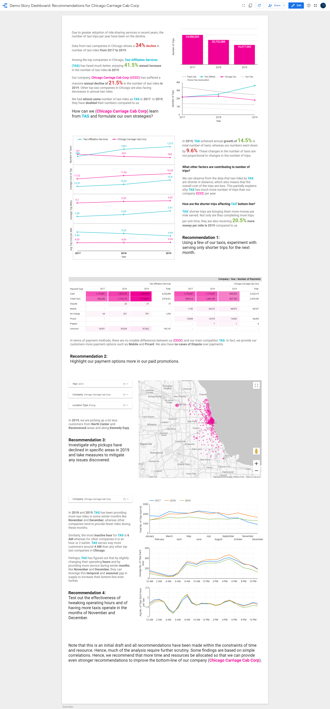

# Dashboard Storytelling - Chicago Taxi Trips :taxi:

Mini project that walks through the process of finding story from data and bringing that story to life through effective use of text and visualizations.

### Links
:bulb: Data exploration notebook: https://colab.research.google.com/drive/1XiDFzYzYuwX98Yd_KWQZe9bZvWGh79Pf?usp=sharing

:bar_chart: Story Dashboard: https://datastudio.google.com/reporting/c5a861a8-2db0-4e74-b878-986bf5911063

### Blog posts :newspaper:

##### Part 1
https://www.stackreate.com/problem-framing-data-understanding/

### Dashboard Screenshot :art:

